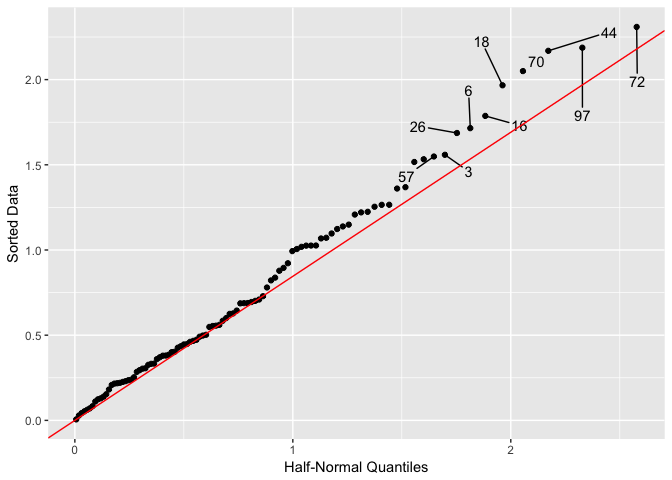

<!-- README.md is generated from README.Rmd. Please edit that file -->
[](http://www.repostatus.org/#active) [](https://travis-ci.org/nathaneastwood/gghalfnorm) [](http://www.r-pkg.org/pkg/gghalfnorm) [](http://www.r-pkg.org/pkg/remotes) [](https://codecov.io/gh/nathaneastwood/gghalfnorm)

> Half-Normal Plots

This package provides a wrapper around the [halfnorm](https://github.com/cran/faraway/blob/master/R/faraway.R#L78) function from the [faraway](https://github.com/cran/faraway) package using the ggplot2 API. The `gghalfnorm` function is the only function within the package.

Usage
=====

``` r
set.seed(123)
gghalfnorm(x = rnorm(100), nlab = 10)
```


The function can also make use of the `geom_text_repel` function from the [ggrepel](https://github.com/slowkow/ggrepel) package.

``` r
set.seed(123)
gghalfnorm(x = rnorm(100), nlab = 10, repel = TRUE, box.padding = unit(1, "lines"))
```



Installation
============

Install the latest stable release from CRAN:

``` r
install.packages("gghalfnorm")
```

Alternatively, install the latest development version from github:

``` r
install.packages("devtools")
devtools::install_github("nathaneastwood/gghalfnorm")
```
